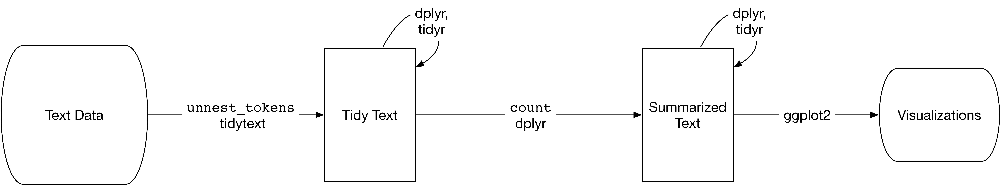

```{r init, include=F}
library(knitr)
opts_chunk$set(message=FALSE, warning=FALSE, eval=TRUE, echo=TRUE, cache=FALSE)
options(digits=3)
options(max.print=200)
.ex <- 1 # Track ex numbers w/ hidden var. Increment each ex: `r .ex``r .ex=.ex+1`

library(ggplot2)
theme_set(theme_minimal(base_size=12) + theme(strip.background = element_blank()))
```

## Class overview

<small>

> **_Attribution_:** This workshop was inspired by and/or modified in part from [_Text Mining with R_](https://www.tidytextmining.com/) by Julia Silge and David Robinson..

</small>

Most of the data we've dealt with so far in this course has been rectangular, in the form of a data frame or tibble, and mostly numeric. But lots of data these days comes in the form of unstructured text. This workshop provides an overview of fundamental principles in text mining, and introduces the **[tidytext](https://cran.r-project.org/web/packages/tidytext/index.html)** package that allows you to apply to text data the same "tidy" methods you're familiar with for wrangling and vizualizing data.

Course pre-requisites:

- [R Basics](r-basics.html) 
- [Data frames](r-dataframes.html)
- [Manipulating and analyzing data with **dplyr**](r-dplyr-yeast.html) (and the associated [homework](r-dplyr-homework.html))
- [Tidying data with **tidyr**](r-tidy.html)
- [Data visualization with **ggplot2**](r-viz-gapminder.html) (and the associated [homework](r-viz-homework.html))

This course is _not_ an extensive deep dive into natural language processing (NLP). For that check out the [CRAN task view on NLP](https://cran.r-project.org/web/views/NaturalLanguageProcessing.html) for a long list of packages that will aid you in computational linguistics.

Before we get started, let's load the packages we'll need.

```{r}
library(tidyverse)
library(tidytext)
library(gutenbergr)
```


## The Tidy Text Format

In the previous lessons linked above we discussed the three features of Tidy Data, as outlined in Hadley Wickham's [Tidy Data paper](http://vita.had.co.nz/papers/tidy-data.html):

- Each variable is a column
- Each observation is a row
- Each type of observational unit is a table

Tidy text format can be defined as **a table with one-token-per-row.** A **token** is any meaningful unit of text, such as a word, that we are interested in using for analysis. **Tokenization** is the process of splitting text into tokens. This is in contrast to storing text in strings or in a document-term matrix (discussed later). Here, the token stored in a single row is most often a single word. The **[tidytext](https://cran.r-project.org/web/packages/tidytext/index.html)** package provides functionality to tokenize strings by words (or n-grams, or sentences) and convert to a one-term-per-row format. By keeping text in "tidy" tables, you can use the normal tools you're familiar with, including dplyr, tidyr, ggplot2, etc., for manipulation, analysis, and visualization. The tidytext package also includes functions to convert to and from other data structures for text processing, such as a _corpus_[^corpus] or a _document-term matrix_.[^dtm]

[^corpus]: Corpus objects contain strings annotated with additional metadata.
[^dtm]: This is a (sparse) matrix describing a collection (corpus) of documents with one row for each document and one column for each term. The value in the matrix is typically word count or tf-idf for the document in that row for the term in that column.



### The `unnest_tokens` function

We briefly mentioned before how to create vectors using the `c()` function. Let's create a simple character vector.

```{r}
text <- c("a", "banana", "crouton")
```

Let's extend that to create another character vector, this time with sentences:

```{r, results='hide'}
text <- c("It was the best of times,",
          "it was the worse of times,",
          "It was the spring of hope, it was the winter of despair.")
text
```

Before we can turn this into a tidy text dataset, we first have to put it in a data frame.

```{r}
text_df <- data_frame(line = 1:3, text = text)
text_df
```

This data isn't yet "tidy." We can't do the kinds of operations like filter out particular words or summarize operations, for instance, to count which occur most frequently, since each row is made up of multiple combined words. We need to convert this so that it has **one-token-per-document-per-row**. Here we only have a single document, but later we'll have multiple documents.

We need to (1) break the text into individual tokens (i.e. *tokenization*) and transform it to a tidy data structure. To do this, we use tidytext's `unnest_tokens()` function.

```{r}
text_df %>%
  unnest_tokens(output=word, input=text)
```

The `unnest_tokens` function takes a data frame (or tibble), and two additional parameters, the `output` and `input` column names. If you specify them in the correct order, you don't have to specify `output=` or `input=`. You can pipe to `print(n=Inf)` to print them all.

```{r, results='hide'}
text_df %>%
  unnest_tokens(word, text) %>% 
  print(n=Inf)
```

First you give it the output column name that will be created as the text is unnested into it (`word`, in this example). This is a column name that you choose -- you could call it anything, but `word` usually makes sense. Then you give it the input column that the text comes from in the data frame you're passing to it (`text`, in this case). Our `text_df` dataset has a column called `text` that contains the data of interest.

The `unnest_tokens` function splits each row so that there is one word per row of the new data frame; the default tokenization in `unnest_tokens()` is for single words, as shown here. Also notice:

- Other columns, such as the line number each word came from, are retained.
- Punctuation has been stripped.
- By default, `unnest_tokens()` converts the tokens to lowercase, which makes them easier to compare or combine with other datasets. (Use the `to_lower = FALSE` argument to turn off this behavior).

Now our data is in a tidy format, and we can easily use all the normal dplyr, tidyr, and ggplot2 tools.

### Example: Jane Austen Novels

```{r, echo=FALSE, include=FALSE}
janeaustenr::austen_books() %>% 
  group_by(book) %>%
  mutate(linenumber = row_number(),
         chapter = cumsum(str_detect(text, regex("^chapter [\\divxlc]",
                                                 ignore_case = TRUE)))) %>%
  ungroup() %>% 
  filter(text!="") %>% 
  write_csv("data/austen.csv")
```

Let's load the **[austen.csv](data/austen.csv)** data. 

```{r, results='hide'}
jaorig <- read_csv("data/austen.csv")
jaorig
```

Click the `jaorig` dataset in the environment pane or use `View(jaorig)` to see what's being read in here. Before we can do anything else we'll need to tidy this up by unnesting the `text` column into words.

```{r, results='hide'}
jatidy <- jaorig %>% 
  unnest_tokens(word, text)
jatidy
```

Let's use the dplyr `count` function to count how many occurances we have for each word in the entire corpus. The `sort=TRUE` option puts the most common results on top.

```{r, results='hide'}
jatidy %>%
  count(word, sort = TRUE) 
```

Not surprisingly the most common words are some of the most commonly used words in the English language. These are known as [stop words](https://en.wikipedia.org/wiki/Stop_words). They're words you'll want to filter out before doing any text mining. There are lists of stop words online, but the tidytext package comes with a `stop_words` built-in dataset with some of the most common stop words across three different lexicons. See `?stop_words` for more information.

```{r, results='hide'}
data(stop_words)
stop_words
```

As in a previous lesson where we did an `inner_join` to link information across two different tables by a common key, there's also an [`anti_join()`](https://dplyr.tidyverse.org/reference/join.html#join-types) which takes two tibbles, _x_ and _y_, and returns all rows from _x_ where there are not matching values in _y_, keeping just columns from _x_. Let's go back to where we created the tidy data, and `anti_join` this to the `stop_words` dataset.

```{r, results='hide'}
jatidy <- jaorig %>% 
  unnest_tokens(word, text) %>% 
  anti_join(stop_words)
jatidy
```

Now there are _far_ fewer rows than initially present. Let's run that count again.

```{r}
jatidy %>%
  count(word, sort = TRUE) 
```

That's _much_ more in line with what we want. We have this data in a tibble. Let's keep piping to other operations!

```{r}
jatidy %>%
  count(word, sort = TRUE) %>% 
  head(20) %>% 
  mutate(word = reorder(word, n)) %>%
  ggplot(aes(word, n)) +
  geom_col() +
  coord_flip()
```

## Sentiment Analysis


## Word and Document Frequencies

### Project Gutenberg

Project Gutenberg (<https://www.gutenberg.org/>) is a collection of freely available books that are in the public domain. You can get most books in all kinds of different formats (plain text, HTML, epub/kindle, etc). The **[gutenbergr](https://cran.r-project.org/web/packages/gutenbergr/vignettes/intro.html)** package includes tools for downloading books (and stripping header/footer information), and a complete dataset of Project Gutenberg metadata that can be used to find words of interest. Includes:

* A function `gutenberg_download()` that downloads one or more works from Project Gutenberg by ID: e.g., `gutenberg_download(84)` downloads the text of Frankenstein.
* Metadata for all Project Gutenberg works as R datasets, so that they can be searched and filtered:
  * `gutenberg_metadata` contains information about each work, pairing Gutenberg ID with title, author, language, etc
  * `gutenberg_authors` contains information about each author, such as aliases and birth/death year
  * `gutenberg_subjects` contains pairings of works with Library of Congress subjects and topics

Search https://www.gutenberg.org/ for "H G Wells" and click on one of the results. You'll see the book ID in the URL. One thing we might do in text mining is to compare word frequencies across different texts. We loaded Jane Austen's novels from a file. Let's use gutenbergr to get two more sets of texts. First, let's look at some science fiction and fantasy novels by H.G. Wells, who lived in the late 19th and early 20th centuries. Let's get [*The Time Machine*](https://www.gutenberg.org/ebooks/35), [*The War of the Worlds*](https://www.gutenberg.org/ebooks/36), [*The Invisible Man*](https://www.gutenberg.org/ebooks/5230), and [*The Island of Doctor Moreau*](https://www.gutenberg.org/ebooks/159). We can access these works using `gutenberg_download()` and the Project Gutenberg ID numbers for each novel.

```{r, include=FALSE}
# saveRDS(hgwells, "data/_hgwells.rds")
hgwells <- readRDS("data/_hgwells.rds")
# saveRDS(bronte, "data/_bronte.rds")
bronte <- readRDS("data/_bronte.rds")
```


```{r, eval=FALSE}
library(gutenbergr)
hgwells <- gutenberg_download(c(35, 36, 5230, 159))
hgwells
```

Let's get some well-known works of the Bronte sisters, whose lives overlapped with Jane Austen's somewhat but who wrote in a rather different style. Let's get [*Jane Eyre*](https://www.gutenberg.org/ebooks/1260), [*Wuthering Heights*](https://www.gutenberg.org/ebooks/768), [*The Tenant of Wildfell Hall*](https://www.gutenberg.org/ebooks/969), [*Villette*](https://www.gutenberg.org/ebooks/9182), and [*Agnes Grey*](https://www.gutenberg.org/ebooks/767). 

```{r, eval=FALSE}
bronte <- gutenberg_download(c(1260, 768, 969, 9182, 767))
bronte
```

Now let's tidy each dataset:

```{r, results="hide"}
hgtidy <- hgwells %>% 
  unnest_tokens(word, text) %>% 
  anti_join(stop_words)
hgtidy

brtidy <- bronte %>% 
  unnest_tokens(word, text) %>% 
  anti_join(stop_words)
brtidy
```

Now let's look at the top words in each:

```{r}
hgtidy %>% 
  count(word, sort=TRUE)

brtidy %>% 
  count(word, sort=TRUE)
```


```{r}

```

